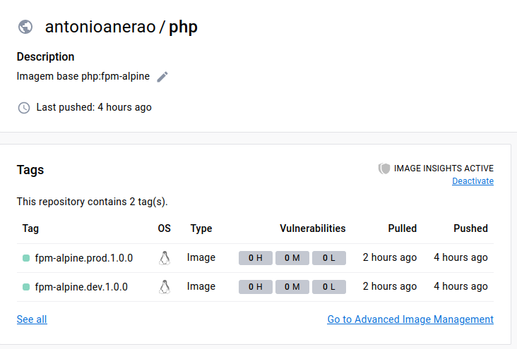
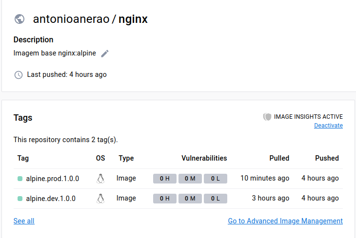

## Build para imagem nginx e php-fpm

<a href="https://hub.docker.com/r/antonioanerao/php"></a><a href="https://hub.docker.com/r/antonioanerao/nginx"></a>

<hr>

Com esse repositório você fará o `build` de duas imagens, uma rodando `nginx` servindo como proxy reverso e a outra com `php`, que processará os arquivos `.php`

### Como usar

Faça um cópia do arquivo _`env.example`_  com o nome _`.env`_ e altere o valor das variáveis de acordo com suas necessidades.

``` bash
$ cp env.example .env
``` 

São duas opções para fazer o `build` da sua imagem. A primeira é executando os arquivos _`docker-compose.dev.yml`_ e _`docker-compose.prod.yml`_.

### Rodando com os arquivos docker-compose

A versão .dev monta um volume para os arquivos do seu projeto, permitindo que você faça a edição deles durante o processo de desenvolvimento. 

A versão .prod faz uma cópia do seu projeto direto para o container, impedindo a edição dos arquivos no `host`. A versão prod também conta com o [OPcache](https://www.php.net/manual/pt_BR/book.opcache.php) instalado.

``` bash
$ docker-compose -f docker-compose.dev.yml build
``` 

Após fazer o `build`, você pode subir seus dois containers

``` bash
# versão dev
$ docker-compose -f docker-compose.dev.yml up -d

# versão prod
$ docker-compose -f docker-compose.prod.yml up -d
``` 

### Rodando com os arquivos Dockerfile

Existem dois arquivos separados para a versão dev e prod, sendo um arquivo para o nginx e outro para o php. Eles ficam dentro de `build/dev` e `dev/prod`

``` bash
# versão dev
$ docker build -t nome-da-imagem:versao -f build/dev/nginx/Dockerfile .
$ docker build -t nome-da-imagem:versao -f build/dev/php/Dockerfile .

# versão prod
$ docker build -t nome-da-imagem:versao -f build/prod/nginx/Dockerfile .
$ docker build -t nome-da-imagem:versao -f build/prod/php/Dockerfile .
```

### Build multi-arch

``` bash
# Ative o drive que suporta multi-arch
$ docker buildx create --use

# troque o build/dev para build/prod se estiver buildando a versão para produção
$ docker buildx build --push --platform linux/arm64/v8,linux/amd64 --tag nome-da-imagem:versao -f build/dev/php/Dockerfile .
```

#### PHP Modules
    - Core
    - ctype
    - curl
    - date
    - dom
    - fileinfo
    - filter
    - ftp
    - gd
    - hash
    - iconv
    - json
    - libxml
    - mbstring
    - mysqlnd
    - openssl
    - pcre
    - PDO
    - pdo_sqlite
    - pdo_sqlsrv
    - Phar
    - posix
    - random
    - readline
    - Reflection
    - session
    - SimpleXML
    - sodium
    - SPL
    - sqlite3
    - sqlsrv
    - standard
    - tokenizer
    - xml
    - xmlreader
    - xmlwriter
    - Zend OPcache (versão de produção apenas)
    - zlib


#### *Certifique-se de que o GUID do seu grupo www-data seja o mesmo que o GUID do grupo www-data dentro do container
    
#### Prefere apenas rodar as imagens e subir seu container sem fazer o build da imagem?
- Imagem para o Nginx: [https://hub.docker.com/r/antonioanerao/nginx](https://hub.docker.com/r/antonioanerao/nginx)
- Imagem para o PHP: [https://hub.docker.com/r/antonioanerao/php](https://hub.docker.com/r/antonioanerao/php)
